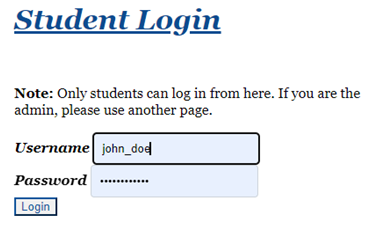

# E-library

## Introduction
This project is a library management system designed to cater to the needs of both students and administrators. It provides different functionalities based on the user role, allowing students to manage their profiles and view borrowed books, while administrators can manage books, users, and borrow records.

## Features
### For Students
- **Registration:** Students can register for an account.
- **Login:** Students can log in to their accounts.
- **Profile Management:** Students can view and edit their profiles.
- **Password Change:** Students can change their passwords.
- **View Borrowed Books:** Students can see the books they have borrowed.

### For Administrators
- **Login:** Administrators can log in to their accounts.
- **Book Management:** Administrators can add books, view all books, and change their statuses (e.g., mark as available or unavailable).
- **Borrow Record Management:** Administrators can view all borrowed books and create new borrow records.
- **User Management:** Administrators can view all students and create new borrow records for them.

## Samples of some pages
### Website Homepage
On the homepage of the website, all available and upcoming books can be viewed.

### View all students (for administrator)

### View all books (for administrator)

### Student registration 

### Student login
